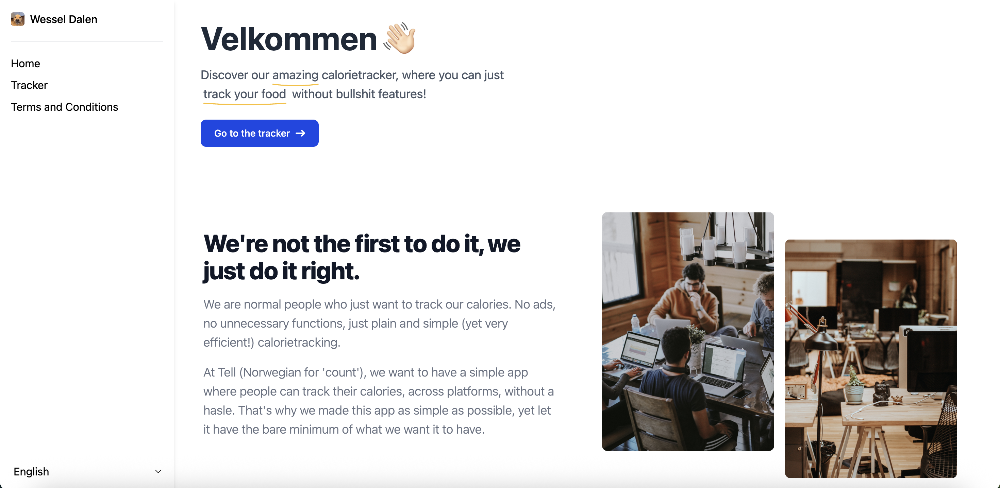
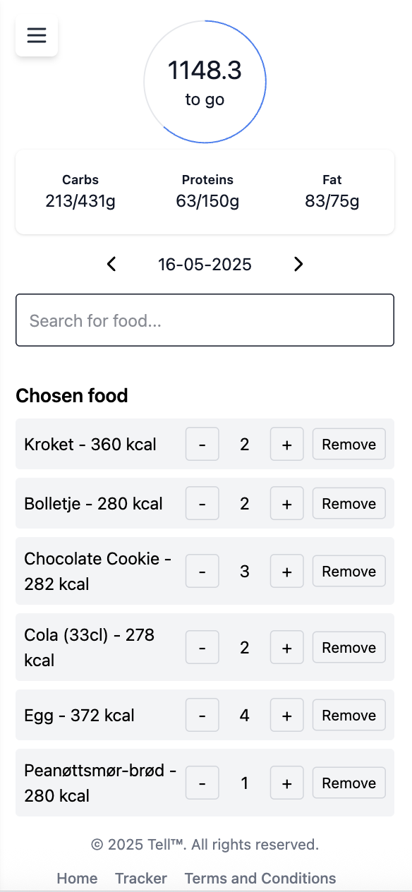

# Tell - den enkle måten å spore mat på

  
Tell (norsk for "å telle") er en enkel applikasjon som jeg - <a href="https://wesseldalen.eu">Wessel van Dalen</a> - har laget. Applikasjonen er basert på React Typescript + Tailwindcss, med Flowbite komponenter.
  

*** 

### Spor (blant annet) kaloriene dine

Her hos Tell kan du spore kaloriene dine, samtidig som du får se hvor mye karbohydrater, proteiner og fetter du har spist. Og det beste av alt? Alt er gratis!    Tell har en stor database med forskjellige matvarer, og du kan spore maten din helt selv med en enkel, minimalistisk UI og UX.

 

***

### Tilgjengelige språk
For å ta vare på våre skandinaviske røtter, er applikasjonen tilgjengelig i 9 forskjellige språk, blant annet:

- Engelsk
- Norsk
- Færøysk
- Islandsk
- Svensk
- Dansk
- Finsk
- Estisk
- Nederlandsk

***

### Spørsmål (og eventuelt andre ting)

Har du interesser i dette prosjektet / lurer du på en ting? 
Gjerne send meg en e-post da!

<a href="mailto:wesselvandalen@gmail.com">wesselvandalen@gmail.com</a>